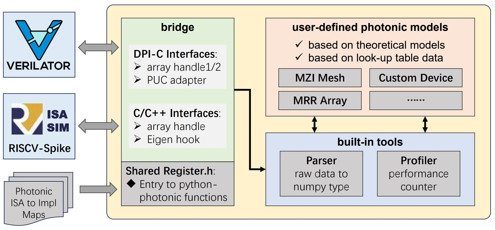

# FIONA-Photonic: Photonic Models integrated with SpikeSim & SystemVerilog

[](https://github.com/hkust-fiona/) 
[](https://iccad.com/)
[](https://github.com/hkust-fiona/fiona-photonic/LICENSE)

🎉Welcome to the **FIONA Photonic** repository!   
🎯This sub-project is an integral part of the [FIONA-Toolchain](https://github.com/hkust-fiona/) and aims to provide a comprehensive photonic model framework spanning from the device level to the circuit level. FIONA-Photonic comprises:
1. **a bundle of parametric scripts** that enable fast multi-physics simulation in *Lumerical* and exporting compact models of photonic devices or circuits;
2. **a unified photonic simulation engine** that supports co-simulation between photonic compact models and electronic sub-systems in SpikeSim or SystemVerilog-compatible simulators (*e.g. Verilator*).



🛠️More specifically, users can define their photonic models in different manners:

1. **Analytical Models from Optic Theories:** The models can easily define in Python, our engine will automatically handle the data interaction between SystemVerilog/C++ and Python. 
2. **Look-Up Tables from Experimental Data:** We provide built-in tools and scripts to convert emulation sweeping data or experimental data into Python LUT as photonic compact models.


## Quickstart for Bridge of Photonic Simulation Engine
🐣Try to run the sample programs before getting your hands dirty to insert your own models. Successful running indicates the development environment is okay. 

```bash
# get the repository
git clone https://github.com/hkust-fiona/fiona-photonic && cd fiona-photonic/

# build the test sample programs
mkdir build/ && cd build/
cmake -DUSE_EIGEN=off .. && make

# run two example programs
./FionaPhotonic_Spike
./FionaPhotonic_Verilator
```

📋The checklist of required steps to add your customized models is shown as follows: 

|**Files**|**Actions**|
|---|---|
|`pyfunc/<your_model>.py`|create your own python-photonic model|
|`pyfunc/profiler.py`|register the monitor variables and functions|
|`bridge/register.h`|add the python file and function into registry|

### 1. Create your own python-photonic model
Under the file of `pyfunc/<your_model>.py`, use built-in **Parser** class to auto handle the data conversion among SystemVerilog / C++ / Python. 

```python
import numpy as np
from .utils.parser import Parser

@profiler(latency=2e-9, power=3e-3)
def mrr_dotp(shape_out, matrix_in1, matrix_in2, bit_out=None, bit_in1=None, bit_in2=None):
    parser = Parser(shape_out, matrix_in1, matrix_in2, bit_out=bit_out, bit_in1=bit_in1, bit_in2=bit_in2)
    comp_in1, comp_in2 = parser.get_in()
    # add microring analytical model here ...
    return parser.set_out(comp_out)
```

### 2. Register the Monitor Variables and Functions
Modify the file of `pyfunc/profiler.py`, define your *results of interest* (ROI) function. The ROI function is like a highly-customized hook that can flexibly plug into monitor. The profiler will count the results based on your defined rules whenever the SpikeSim or SystemVerilog would call the Python-Photonic models.

```python
# add energy ROI function
def energy_roi_func(monitor_dict: dict, spec_dict: dict):
    # suppose this roi_func for `total_energy`
    previous_state = monitor_dict.get('total_energy', 0.0)
    current_consumption = spec_dict['power'] * monitor_dict['cycle_time']
    return previous_state + current_consumption

# update profiler registry
profiler = Profiler(cycle_time=1e-9)
profiler.register('total_energy', energy_roi_func)
```

### 3. Add the Python-Photonic models into Registry
Within the file `bridge/register.h`, add your function defined at the first step into registry:

```cpp
const PyFileFuncVec pyfilefunc_reg {
    {"test", "ops_single"},
    {"test", "ops_dual"},
    {"ideal_numerical", "dotp"},
    {"ideal_numerical", "mvm"},
    {"<your_model>", "mrr_dotp"}    // match the file <your_model>.py and function name
};
```

### 4. Call Python-Photonic Models in SpikeSim or SystemVerilog
As for *SpikeSim* of **FIONA-V**, remember to export the environmental variable `$FIONA_PHOTONIC_DIR`:

```bash
export FIONA_PHOTONIC_DIR="/path/to/fiona-photonic"
```

Within the file of `<path/to/SpikeSim>/customext/fiona.cc`, suppose we want to add our new microring-based dot-product instruction into FIONA-V: 

```cpp
#include "bridge/spike/engine.h"

class fiona_rocc_t : public rocc_t {
    public:
        const char* name() { return "fiona"; }

        reg_t custom0(rocc_insn_t insn, reg_t xs1, reg_t xs2)
        {
            uint32_t rd_num = insn.rd;
            uint32_t rs1_num = insn.rs1;
            uint32_t rs2_num = insn.rs2;
            vreg_t result = 0;

            instr_count[instr_name[insn.funct]] += 1;
            switch (insn.funct) {
                case FUNCT_MRR_DOTP:
                    // prepare operands ...
                    array_handle("<your_model>", "mrr_dotp", ...);
                    break;
            }
    
};
```

As for SystemVerilog, involve `bridge/verilator/puc_adapter.sv` and call python-photonic by:

```verilog
bit [15:0] ad_value [5:0][1:0];
bit [23:0] da_value1 [5:0][1:0];
bit [11:0] da_value2 [7:0];

// single operand
array_handle1("test", "ops_single", ad_value, da_value1);

// dual operands
array_handle2("test", "ops_dual", ad_value, da_value1, da_value2);
```


🍻Congrats! Now your own microring-based dot-product operator has been added into FIONA-V and ready for photonic-electronic co-simulation! For more details, please refer to the test programs under `test/spike/` and `test/verilator/`.

🚀We also demonstrate a case study called *LightRocket* in our paper, which has included a detailed figure showcasing inter-module connections for reference. As for the design of photonic ISA, please refer to the sibling repository: [FIONA-SpikeSim](https://github.com/hkust-fiona/fiona-spikesim).


## Citations
🎓Please cite the following paper if you find this work useful:

> Yinyi Liu, Bohan Hu, Zhenguo Liu, Peiyu Chen, Linfeng Du, Jiaqi Liu, Xianbin Li, Wei Zhang, Jiang Xu. **FIONA: Photonic-Electronic Co-Simulation Framework and Transferable Prototyping for Photonic Accelerator.** In *2023 IEEE/ACM International Conference on Computer-Aided Design (ICCAD).* IEEE, 2023.

## Acknowledgements
❤️I would like to express my sincere gratitude and appreciation to several organizations for their invaluable contributions to my work. Without their support, this endeavor would not have been possible:

|**Organizations**|**Supports**|
|---|---|
|[University Grants Committee (Hong Kong)](https://www.ugc.edu.hk/eng/ugc/index.html)|Research Funds|
|Guangzhou-HKUST(GZ) Joint Funding Program|Research Funds|


